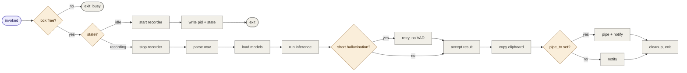

# asryx

<p align="center">
  <a href="./assets/demo.gif">
    
  </a>
</p>

## Overview

Ultra-lightweight C++ speech recognition program, offline and native for Linux.

The program is a [CLI](#cli) that's also a stateless toggle (you can keybind to Hyprland, Sway, i3, GNOME, KDE, etc).

Runs local transcription against [GGML Whisper](https://github.com/ggml-org/whisper.cpp), linked in [process](/src/engine/transcription/whisper/api.cpp).

Daemonless, and there is no ASR server, background daemon, hosted API, cloud, Python/PyTorch abstractions, pip, cargo, npm, Docker, GUIs, dashboards, subscriptions, telemetry, etc.

Nothing.

Runs on the CPU by default. [GPU](/docs/gpu.md) is also supported if you install/have the right drivers.

Inference throughput is sub-second on modern hardware (AVX2/AVX-512 on CPUs and CUDA or Vulkan on GPUs).

The final ELF binary is ~2.1mb (more on this [below](#my-issues-with-the-ecosystem)).

Easily [installed](#installation), one command, you compile the program on your own machine (native to your architecture), no package manager needed, and no external libraries/packages.

This is just pure C++ (albeit C++23) and standard Linux [tools](#dependencies).

And more importantly easily [removed](#uninstallation), also one command, everything is wiped clean as if it never was installed.

The transcription runs against locally downloaded [GGML models](https://huggingface.co/ggml-org) (supports [99 languages](https://github.com/openai/whisper#available-models-and-languages)). The weights load into memory only when transcribing to supply inference (and offload when done), while `asryx` owns the entire native Linux runtime.

Daemonless as in, when you're not actively speaking, the process doesn't exist in memory.

You press a key once, say you hit `Alt + W` (or whatever keybind you set the toggle to), it launches, tells Linux to record audio, and kills itself (0 MB RAM).

You can walk around and talk (no need to press and hold anything) as long as you want (~9MB RAM talking).

When done, hit `Alt + W` again, it launches, stops recording, feeds the audio buffer to the local [Whisper](https://github.com/openai/whisper) models (you choose/download through the CLI), along with a [VAD](https://developers.openai.com/api/docs/guides/realtime-vad) model (removes non-speech, noises, etc), retries on hallucinations, copies the text, notifies you (or pipes to another command also), removes everything, and kills itself again (back to 0 MB RAM).

## My issues with the ecosystem

### One

The Unix philosophy is nonexistent, especially for Linux, what happened to "do one thing, do it well"?

Almost every tool I see is trying to support every workflow, OS, inference engine, deployment topology, cloud provider, hypothetical user requirement, trying to max out the most theoretical total addressable market imaginable, serving everyone, yet no one.

This program is made by a [hardcore Linux user](https://github.com/rccyx/osyx) for hardcore Linux users.

### Two

I don't trust black box tools, things I can't audit or fully understand the workings of.

If something runs locally on my machine almost 24/7, handling sensitive data, I can't randomly trust pre-compiled binaries or pull down a ton of packages with these supply chain risks everywhere.

I prefer to compile it on my own machine if possible, but before this I need to read the code, if it's not readable, I'm not using it.

Before installing anything, I ask the same questions:

How do I remove this later? What if I don't like it? What does it actually do to my machine? Can I trace the calls it makes in code? What's it doing? Can I parse the code logic? Is it badly architected and going to blow up randomly? Does removal just mean `cargo uninstall <BINARY>` while orphan directories are scattered deep inside `~/.cache`, `~/.config`, or `/tmp`?

See? Many questions.

So, the codebase is written in a way that's easily parseable (reads like pseudocode + no 3k LOC files doing 50 different things).

<details>
<summary><strong>Plus, here's the mechanism explaining why and how everything works</strong></summary>

<br/>

I wanted to build the best possible solution for hardcore Linux users who rely on keybinds all day and demand hyper-efficiency.

There's no macOS or Windows support, no GUIs, and zero overhead. It simply follows a strict bare metal philosophy to make everything intuitively fast.

Even on my own daily driver , I stripped out the top bar to maximize speed .

I compile and build a lot of software from scratch, way beyond just dumping dots or shell scripts. I've open sourced some of these tools recently, and this project is one of them.

When I use software, I just want to get straight to the point. Everything on my desktop comes through notifications, like getting a heads-up when my battery runs low for example. I use Hyprland to switch between workspaces super fast and wanted a speech recognition tool that fit that exact workflow.

I couldn't find anything like it anywhere.

Also, I don't want to reinvent the wheel.

Installing a massive third-party audio library just to capture sound makes no sense, and I didn't want extra libs or third-party bindings just to show notifications.

People usually choose a tool and force a solution onto it. Take Rust, for example. You need to record audio, so you embed a bloated library like cpal or rodio. You need to copy text, so you embed a cross-platform clipboard manager. You need desktop alerts, so you embed a notification framework and try to make it cross-platform anyway, because why not?

I don't need any of this. This program relies on delegation. Linux already has world-class tools running natively, so why not use them?

If you're running a physical daily Linux machine, those native tools are already installed and working.

I chose C++ because whisper.cpp integrates exceptionally well. It binds directly to the codebase and runs fast. I removed some compilation bloat to keep the footprint lightweight though. Whisper works well for now, though I might switch to Nvidia's Parakeet in the future when C++ ports for it stabilize. Even if the backend changes to handle things like streaming, the CLI and overall user experience stay identical.

Managing session state without forcing users to handle complex configuration files or leaving a daemon sitting in memory required a stateless toggle architecture. The program acts as an orchestrator over standard Linux tools. You delegate tasks out to standard utilities and avoid embedding redundant features into a massive binary.

The binary starts when you invoke it, performs one operation, and exits.

```bash
asryx
```

On the first press, it starts recording and exits.

Meaning, while you're talking, `asryx` itself isn't running. Only the native recorder remains, that's `pw-record` or `arecord`.

On the second press, it stops recording, loads the weights into memory (base.en, large-v1, etc + VAD), transcribes the captured audio, delivers the result, cleans the session, and exits again.

## Runtime and locking

What happens if you spam the global key 55 times? Nothing.

You won't create multiple recorders, run multiple transcriptions, or mutate the same session simultaneously.

Reliability is the word.

Also, a dead process can't leave the application permanently stuck in a bad state.

Every active transcription session is under:

```text
$XDG_RUNTIME_DIR/asryx
```

If `$XDG_RUNTIME_DIR` is unavailable, it defaults to:

```text
/tmp/asryx-$UID
```

The runtime uses an atomic directory lock:

```text
lock/
lock/pid
```

Why?

Because creating a directory is an atomic filesystem operation. When several invocations arrive at the same time, only one can create `lock/` and become the active operation (guaranteed by the kernel).

The winner writes its PID to `lock/pid`.

The others inspect that PID. If its owner is still alive, they exit without touching the active session. If the owner is dead, the lock is stale, so it's removed and reclaimed.

## Runtime files (Session files)

A session may contain:

| File        | Purpose                                                              |
| ----------- | -------------------------------------------------------------------- |
| `lock/`     | Prevents two operations from controlling the session simultaneously. |
| `lock/pid`  | Identifies the `asryx` process that owns the current operation.      |
| `rec.pid`   | Identifies the active PipeWire or ALSA recorder.                     |
| `rec.wav`   | Contains the temporary captured audio.                               |
| `rec.err`   | Captures errors written by the recorder.                             |
| `state`     | Records whether the session is recording or transcribing.            |
| `cancel`    | Requests that active inference abort.                                |
| `error.log` | Preserves the actual failure when something goes wrong.              |

All of these files are disposable session state, except `error.log`, since it's retained after a failure so the evidence doesn't disappear with the cleanup and you know what happened.

## Recording and transcription

The first invocation cleans any abandoned payload from an older dead session, reads the configuration, checks that the selected Whisper model and VAD model are installed, and starts a native recorder.

PipeWire is preferred. ALSA is the fallback.

The recorder writes a normal 16 kHz mono PCM WAV file to:

```text
rec.wav
```

Its PID goes into `rec.pid`, its errors go into `rec.err`, and the session flips to a `recording` state.

Then the program releases the lock and exits.

When you hit the keybind again, it finds the live recorder PID and stops it. It begins with `SIGINT` so the recorder can finish and close the WAV correctly. If the recorder refuses to exit, it escalates through `SIGTERM` and finally `SIGKILL`.

The WAV is then read and parsed directly (have a look at [`src/engine/audio`](/src/engine/audio/)).

It avoids external dynamic multimedia libraries like FFmpeg, PortAudio, or SDL2 so it stays lean.

RIFF/WAVE validation, chunk traversal, PCM16 decoding, and sample conversion are implemented directly in standard C++.

If you run `ldd` against the binary, you'll see that there's just the normal system runtime and basically nothing else:

```bash
$ ldd build/release/asryx
    linux-vdso.so.1
    libm.so.6
    libstdc++.so.6
    libgcc_s.so.1
    libc.so.6
    ld-linux-x86-64.so.2
```

No FFmpeg tree. No missing `libwhatever.so.47` whatsoever when you move to another machine.

The parser verifies that the file is a structurally valid stream, finds its format and sample data, rejects malformed boundaries and unsupported formats, and converts the signed PCM16 samples into normalized floats.

The implementation is strict (doesn't feed partially written, truncated, empty, or incorrectly aligned audio).

On the second press, after the WAV has been validated and decoded, it initializes a Whisper context directly inside the current process.

There is no IPC layer and no client/server boundary, it's all in process.

One inference backend is selected when the binary is compiled:

```text
CPU
CUDA
Vulkan
```

The CPU build chooses a bounded thread count based on the machine instead of consuming every logical core it can find. GPU builds use the selected GPU backend with a smaller CPU helper pool.

After a successful transcription and delivery, `rec.wav` is deleted along with the rest of the disposable session.

### VAD safety net

The primary transcription pass uses the local Silero VAD model (downloaded automatically upon installation along with the `base.en` model at `~/.local/share/asryx/models`).

VAD tells Whisper which regions contain speech, which allows it to ignore long silence, dead air, breathing, keyboard noise, room noise, and other empty sections that might confuse the decoder.

That improves both speed and output quality, but VAD isn't infallible. Sometimes it can classify real speech as silence and give Whisper too little audio.

For example, say you speak for 30 seconds about the political and economic state of the world and then all you get is: "Hey, Hey".

It runs a check here.

After the first pass, it runs speech detection over the same decoded samples and calculates how many seconds of speech were actually detected.

It then compares that duration against how much meaningful content Whisper returned.

The threshold is conservative. It assumes that even extremely slow speech should produce roughly 1 meaningful content unit for every 8 seconds of detected speech.

When the result is suspicious, it performs a second inference pass using the same loaded model and the same decoded samples, but with VAD disabled and non-speech handling made more permissive.

This is just a known bug with Whisper architecture (I might later move to a better alternative).

Keep in mind that the retry doesn't automatically win, but it often does, which is better than nothing.

It replaces the first result only when it is no longer suspicious or contains at least twice as much meaningful content. If the retry is empty or worse, the original output stays.

## Clipboard and piping

The clipboard is always handled first:

```text
wl-copy
```

with:

```text
xclip -selection clipboard
```

as the X11 fallback.

The transcript is sent through the clipboard process's standard input.

If clipboard delivery succeeds and no custom command is configured, the session is finished and cleaned.

When `pipe_to` is configured, the exact same transcript is then passed to the configured command through standard input:

The configured command is executed by the shell, while the text moves separately through stdin.

This makes the clipboard the safety path.

If the custom command fails, the transcript has already been copied. The program writes the failure to the log, notifies you, and removes the temporary audio.

## Failure handling

The source relies heavily on `std::expected`.

Errors are first class citizens. There's no "do these 55 steps and catch all" just to say "oops something happened."

Quite a refresher from exceptions to say the least.

Also, there's a bit of perf gains here, since errors are handled at compile-time as value types rather than runtime exceptions, keeping the execution path extremely tight.

Every failure is known. Been running this for a long time at this point, never seen a failure. But in the rare case it happens there's a log file that shows the failure.

Every step is accounted for. So you know exactly what happened in case it happens.

Here's a snippet of the result-able code:

```cpp
yx::Result<TranscriptionContext> _build_context(const std::filesystem::path& runtime_dir,
                                                config::Config config)
{
  return model::transcription_language_for(config).and_then(
      [&runtime_dir, config = std::move(config)](const std::string& language) {
        return model::get_model_path(config.model)
            .and_then([&runtime_dir, config, language](const std::string& model_path) {
              return model::get_vad_model_path().transform(
                  [&runtime_dir, config, language, model_path](std::string vad_model_path) {
                    return TranscriptionContext{
                        .config = config,
                        .request = {.model_path = model_path,
                                    .vad_model_path = std::move(vad_model_path),
                                    .wav_path = session::recorder_wav_path(runtime_dir).string(),
                                    .language = language,
                                    .cancel_marker_path =
                                        session::cancel_marker_path(runtime_dir).string()}
                    };
                  });
            });
      });
}
```

Failures are classified into useful notifications, while the real internal error is written to:

```text
$XDG_RUNTIME_DIR/asryx/error.log
```

If the recorder produced anything in `rec.err`, that output is included too.

The disposable payload is then removed and the lock is released. The log remains.

</details>

TL;DR here's a diagram.



### Three

I don't want to deal with Python venv hell or run containers. Nor do I want a CLI with 70 flags to memorize, a new "best" model dropping every other week from the 8th provider, or a README that requires me to weigh options for "hybrid CTC/DTC decoders, 0.6B vs 1B parameter counts, EOU detection, RNN..." I have no time for this.

All I want is to press a key, talk for 15 minutes straight walking around, and have my transcription magically copied to my clipboard as fast and accurately as humanly possible, and most importantly, never break.

Maybe I'll paste it later, or [pipe](https://man7.org/linux/man-pages/man2/pipe.2.html) it to another program.

I don't want to read, configure, tweak anything. I just want to run one command, and it just works.

It also had to be as light as possible. Speaking of which:

## Footprint & Performance

The final compiled binary is ~2.1 MB.

Inside that tiny footprint is a neural network tensor matrix multiplication logic, execution logic, the application runtime, process management, a custom zero allocation WAV parser, and more.

AI model weights are separate.

A speech recognition program that's smaller than a single 12MP iPhone JPEG photo is basically unheard of in the [ecosystem](#comparisons). (`whisper-cli` itself is 2.6 MB and nowhere near this UX)

The footprint grows only when a phase actually needs it.

Starting from idle, when you hit the toggle, it checks its configuration and runtime state, validates the local model files, launches the recorder, writes its PID and state, notifies you, and exits in 11.2ms (on average across 500 runs.)

Other programs can't do that so they compensate by leaving HTTP/gRPC background daemons/containers permanently resident in RAM. Trading persistent memory pollution (~500MB–2GB of idle RSS) for artificial instant responsiveness.

The short-lived asryx launcher uses 6.49 MB of RAM at the median (across 100 runs) then exits.

While you're speaking, the program itself is no longer running.

The model isn't loaded and there is no daemon sitting around waiting for you. You can speak as long as you want.

Only `pw-record` remains (or `arecord`), using roughly 9.16 MB of RAM, at < 1% CPU usage.

When you hit the toggle again, the recorder stops, the model loads instantly into the same native process, and transcription begins (This is the only time there's a surge in RAM, depending on the size of those weights).

When transcription finishes, the transcript is copied, the model context is released, the temporary audio is removed, and the process exits.

The footprint returns to zero.

`asryx status` starts, checks the runtime, prints the result, and exits in 1.1ms (on average across 1,000 runs.)

It prints either "recording", "transcribing" or "idle".

So what's this for?

This output can be used for status surfaces such as Waybar or Polybar, [control centers](https://github.com/rccyx/ctrlyx), or even high frequency tmux/shell loops every few milliseconds without impacting system load or CPU thermals.

The control plane here still lives in the same low-millisecond world as classic native Linux utilities:

```
/usr/bin/true           0.22ms  (Bare-metal process spawn floor)
/usr/bin/ls -d .        0.42ms  (Standard C coreutils VFS traversal)
asryx status            1.10ms  (Native C++ state & lockfile resolution)
```

Running just docker ps or even hello in python is 7x at least:

```
docker ps               7.50ms  (Daemon IPC & socket serialization)
python3 -c "hello"       8.90ms  (VM runtime initialization)
```

But that's nothing, when it comes to full apps, Python, Node, JVM, and Chromium runtime apps are quite heavy.

### Comparisons

To give you an illustration:

#### Electron-based voice apps

Go anywhere between ~200 MB and ~600 MB of pure unadulterated bloat, take seconds to boot up (on a good day), and since most are GUIs, good luck moving the cursor to the red circle to click the button.

#### Rust and Go STT CLIs/daemons

Start at about 10 MB and go up to 40 MB.

Plus these are usually bloated, they have to bind or rely on heavy deps, and mostly, or realistically, chosen because LLMs know Rust better than C++.

When I review these codebases for possible usage, I'm flabbergasted. The software does everything for everyone (LLM feature creep fatigue) which means they do nothing for no one.

I open a file and see a single 2.5k line file with CLI dispatching, config loading, 200 lines of manual flag overrides (copy-pasted), daemon PID management, inline DSP resampling, notifications wired straight to a status bar's JSON format (hardcoded), an update checker, first launch macOS setup, and more.

That's all I need to know. Not even Gemini 3 Pro has enough context to understand what's going on here let alone me.

#### Python

Aside from env hell, and the hurdles you have to go through to set it up, it takes seconds just to run `import pytorch` and initialize it into memory before touching an audio file or doing anything. By the time Python loads, `asryx` has finished processing a five-second sentence (cold).

Also, Python `faster-whisper` and similar setups pull anywhere from 150 MB to 4 GB+ of PyTorch, CTranslate2 bindings, NumPy, and CUDA runtimes before they're even ready to run.

#### Background servers

Most of these AI and transcription setups make you run a background server (API daemon, systemd, Docker containers etc), that sits there permanently eating 500 MB to 2 GB of idle RAM just waiting for audio. That, in case you actually finished the grueling setup first.

#### SaaS

Privacy + A round trip cloud API request requires DNS resolution + audio payload upload, queue processing, and transcript response download + needs a stable network + I'm definitely not sending my voice to a server over 150 times a day.

## Installation

Clone the repository

```bash
git clone https://github.com/rccyx/asryx && cd asryx
```

Compile and install (defaults to the CPU)

```bash
bash ./package/install
```

That's it.

> [!TIP]
> If you've changed your mind, see the [uninstaller](#uninstallation).

CPU inference works out of the box on x86_64 and ARM64.

GPU acceleration is optional but highly recommended:

- **CUDA** for supported NVIDIA GPUs.
- **Vulkan** as the cross-vendor backend for supported NVIDIA, AMD, and Intel GPUs.

See the [GPU setup](/docs/gpu.md) for the required drivers and build dependencies.

> [!NOTE]
> `main` is branch protected and force pushes are disabled. Anything merged into `main` builds and installs. If you want a versioned snapshot instead (outlining features and everything), see [releases](https://github.com/rccyx/asryx/releases).

<details>
<summary><strong>What the installer does</strong></summary>

<br/>

The installer validates the user environment, checks required tools, clones the pinned native inference source, builds the binary locally, installs the executable, writes the default config, installs the VAD model, installs the default transcription model, selects it, and prints a PATH note when `~/.local/bin` is unavailable from the current shell.

Installed paths:

```text
~
├── .asryx.conf <-- config file
└── .local/
    ├── bin/
    │   └── asryx <-- binary
    └── share/
        └── asryx/ <-- all assets
            ├── deps/
            │   └── whisper.cpp/
            └── models/
                ├── ggml-base.en.bin  <-- Whisper model
                ├── ggml-silero-v6.2.0.bin  <-- VAD model
                └── ...    <-- More models here

```

Default transcription model:

```text
base.en
```

Default VAD model:

```text
ggml-silero-v6.2.0.bin
```

Model downloads pull from [Hugging Face](https://huggingface.co/ggerganov/whisper.cpp).

</details>

## Dependencies

If you hear sound, see notifications, and have installed a non-TTY distro, you probably have everything you need already, but check in case you spawned in a bare metal box:

- **Build Tools:** `git`, `curl`, `cmake`, `ninja-build`, either `clang++` or `g++`
- **Audio Recording:** `pipewire` (for `pw-record`) **or** `alsa-utils` (for `arecord`)
- **Clipboard:** `wl-clipboard` (Wayland) **or** `xclip` (X11)
- **Desktop Notifications:** `libnotify-bin` (for `notify-send`)

> [!IMPORTANT]
> The build requires a **C++23** capable compiler and CMake >= 3.25. On old distros, install either Clang 19+ or GCC 14+ before running `./package/install`.

> [!NOTE]
> C++23 support is universal at this point. Ubuntu 26, Arch, Fedora, NixOS, or Debian Trixie (which is the current stable) automatically ship with compilers that work out of the box.

### Checks

Just to make sure, let's check your audio stack.

Check what you have:

```bash
which pw-record || which arecord
```

PipeWire systems have `pw-record`, ALSA systems have `arecord`. If you have neither, install `pipewire` or `alsa-utils` through your package manager.

For the clipboard, it depends on your session. Hyprland and Sway are Wayland compositors, so they need `wl-clipboard`. i3 uses X11, so it needs `xclip`.

If you're not sure which session you're on, just run:

```bash
echo "$XDG_SESSION_TYPE"
```

For notifications, it uses `notify-send` (from `libnotify` / `libnotify-bin`), which is just a lightweight client binary that sends a standard D-Bus message. Most distros already ship with it.

Check for the standard Freedesktop notification dispatcher:

```bash
which notify-send
```

Install it if it doesn't exist.

> [!IMPORTANT]
> Full environments (GNOME, KDE) handle this natively. Tiling window managers like Hyprland require an active daemon like dunst, mako, or swaync for you to see notifications on your desktop. Here's my mako [configuration](https://github.com/rccyx/osyx/blob/main/packages/flavors/templates/mako.conf.j2) used in the demo.

## Keybind

The binary takes no arguments to toggle, so bind it to a key in the active compositor or desktop environment.

I personally use `Alt + W`, so the config for each DE/WM becomes:

Hyprland:

```ini
bind = ALT, W, exec, asryx
```

Or the new Lua [config](https://github.com/rccyx/osyx/blob/main/config/.config/hypr/_keybinds.lua):

```lua
exec("ALT + W", variables.home .. "/.local/bin/asryx")
```

Sway / i3:

```ini
bindsym $mod+w exec asryx
```

GNOME:

```text
Settings > Keyboard > Custom Shortcuts
command: asryx
```

KDE Plasma:

```text
System Settings > Shortcuts > Custom Shortcuts
command: asryx
```

> [!WARNING]
> You need to have a clipboard manager for long recordings in case you copy something else by mistake after the transcription is emitted.

## CLI

The first invocation starts capture. You talk for as long as you want.

```bash
asryx
```

The next invocation stops capture, transcribes locally, copies the transcript, notifies the session, and cleans the runtime directory.

```bash
asryx
```

Here is the full CLI surface area:

```text
asryx                        # Toggle record/transcribe
asryx status                 # outputs "idle" or "recording" or "transcribing"
asryx --pipe-to '<COMMAND>'  # Set post copy pipe command
asryx --no-pipe              # Clear post copy pipe command
asryx --language <auto|CODE> # Set language
asryx --model list           # List supported models
asryx --model install <MODEL># Download model
asryx --model use <MODEL>    # Switch model
asryx --model uninstall <MODEL># Remove model
asryx cancel                 # Made a mistake? Cancel active recording or transcription
```

List supported models:

```bash
asryx --model list
```

Install a model:

```bash
asryx --model install small.en
```

Select a model:

```bash
asryx --model use small.en
```

Remove a model:

```bash
asryx --model uninstall small.en
```

Set transcription language:

```bash
asryx --language auto
asryx --language en
asryx --language de
```

Set the post copy pipe hook:

```bash
asryx --pipe-to 'tee -a ~/transcripts.txt'
```

`asryx --pipe-to '<COMMAND>'` simply updates `pipe_to` in `~/.asryx.conf` and exits. You can also do it manually.

`--pipe-to` is just a shell command string, so it can be a script path, a binary, or any command expression the shell can run.

> [!IMPORTANT]
> It doesn't verify that the command exists, resolves on `PATH`, or is executable. The command string can point at a shell script, binary, or any command expression. That's your responsibility to verify.

Clear the post copy pipe hook:

```bash
asryx --no-pipe
```

This clears `pipe_to` in `~/.asryx.conf` and exits.

Clipboard output is the default and always happens first. A completed clipboard-only transcription sends this notification:

```text
transcription copied to clipboard.
```

`pipe_to` configures an optional post copy hook:

```text
pipe_to=tee -a /tmp/transcripts.txt
```

When `pipe_to` is non-empty, bare `asryx` copies the transcript to the system clipboard first, then pipes the same text into `pipe_to` through stdin. The pipe path sends this notification:

```text
piped and copied to clipboard.
```

> [!NOTE]
> If your custom pipe command fails or exits non-zero, it catches it, writes the error to the runtime `error.log`, and ensures the text isn't lost by keeping it in the clipboard, notifying you with `copied to clipboard (pipe failed)`.

## Models

| Model              | Disk    | RAM     | Speed vs large |
| :----------------- | :------ | :------ | :------------- |
| tiny / tiny.en     | 75 MiB  | ~273 MB | ~10x           |
| base / base.en     | 142 MiB | ~388 MB | ~7x            |
| small / small.en   | 466 MiB | ~852 MB | ~4x            |
| medium / medium.en | 1.5 GiB | ~2.1 GB | ~2x            |
| large-v3-turbo     | 1.5 GiB | ~2.3 GB | ~8x            |
| large-v1 / v2 / v3 | 2.9 GiB | ~3.9 GB | 1x             |

Speed is relative to large on CPU.

`base.en` is the default. It starts quickly and covers the default English offline transcription path.

`ggml-silero-v6.2.0.bin` is installed alongside the transcription models and used automatically for voice activity detection.

Installed models are stored here:

```text
~/.local/share/asryx/models/
```

Examples:

```text
~/.local/share/asryx/models/ggml-base.en.bin
~/.local/share/asryx/models/ggml-silero-v6.2.0.bin
```

## Configuration

Everything is under `~/.asryx.conf`.

**Model**

`model` selects the active transcription model. Switching via CLI updates the config instantly:

```bash
asryx --model use small.en
```

**Language**

`language` controls transcription language.

```bash
asryx --language es
asryx --language auto
```

English-only models (`tiny.en`, `base.en`, `small.en`, `medium.en`) only accept `en` or `auto`. Multilingual models accept any of the 99 supported language codes.

> [!NOTE]
> Language support and model transcription quality are a property of the [model weights](https://github.com/openai/whisper/blob/c5d42560760a05584c1c79546a098287e5a771eb/whisper/tokenizer.py#L10).

Invalid model and language values are rejected before recording starts.

<details>
<summary><strong>Supported language codes</strong></summary>

<br/>

| Code | Language       |
| ---- | -------------- |
| en   | english        |
| zh   | chinese        |
| de   | german         |
| es   | spanish        |
| ru   | russian        |
| ko   | korean         |
| fr   | french         |
| ja   | japanese       |
| pt   | portuguese     |
| tr   | turkish        |
| pl   | polish         |
| ca   | catalan        |
| nl   | dutch          |
| ar   | arabic         |
| sv   | swedish        |
| it   | italian        |
| id   | indonesian     |
| hi   | hindi          |
| fi   | finnish        |
| vi   | vietnamese     |
| he   | hebrew         |
| uk   | ukrainian      |
| el   | greek          |
| ms   | malay          |
| cs   | czech          |
| ro   | romanian       |
| da   | danish         |
| hu   | hungarian      |
| ta   | tamil          |
| no   | norwegian      |
| th   | thai           |
| ur   | urdu           |
| hr   | croatian       |
| bg   | bulgarian      |
| lt   | lithuanian     |
| la   | latin          |
| mi   | maori          |
| ml   | malayalam      |
| cy   | welsh          |
| sk   | slovak         |
| te   | telugu         |
| fa   | persian        |
| lv   | latvian        |
| bn   | bengali        |
| sr   | serbian        |
| az   | azerbaijani    |
| sl   | slovenian      |
| kn   | kannada        |
| et   | estonian       |
| mk   | macedonian     |
| br   | breton         |
| eu   | basque         |
| is   | icelandic      |
| hy   | armenian       |
| ne   | nepali         |
| mn   | mongolian      |
| bs   | bosnian        |
| kk   | kazakh         |
| sq   | albanian       |
| sw   | swahili        |
| gl   | galician       |
| mr   | marathi        |
| pa   | punjabi        |
| si   | sinhala        |
| km   | khmer          |
| sn   | shona          |
| yo   | yoruba         |
| so   | somali         |
| af   | afrikaans      |
| oc   | occitan        |
| ka   | georgian       |
| be   | belarusian     |
| tg   | tajik          |
| sd   | sindhi         |
| gu   | gujarati       |
| am   | amharic        |
| yi   | yiddish        |
| lo   | lao            |
| uz   | uzbek          |
| fo   | faroese        |
| ht   | haitian creole |
| ps   | pashto         |
| tk   | turkmen        |
| nn   | nynorsk        |
| mt   | maltese        |
| sa   | sanskrit       |
| lb   | luxembourgish  |
| my   | myanmar        |
| bo   | tibetan        |
| tl   | tagalog        |
| mg   | malagasy       |
| as   | assamese       |
| tt   | tatar          |
| haw  | hawaiian       |
| ln   | lingala        |
| ha   | hausa          |
| ba   | bashkir        |
| jw   | javanese       |
| su   | sundanese      |
| yue  | cantonese      |

</details>

## Uninstallation

Your system goes back to the **exact state** it was in **before** you touched the **project**.

```bash
./package/uninstall
```

This simply removes the owned files and folders:

```text
~/.local/bin/asryx
~/.local/share/asryx/
~/.asryx.conf
$XDG_RUNTIME_DIR/asryx
```

> [!NOTE]
> Deletion goes through owned [path validation](/src/platform/fs.cpp) before files or directories are even removed.

## License

Apache-2.0 © @rccyx
